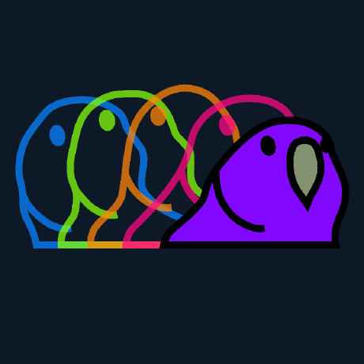
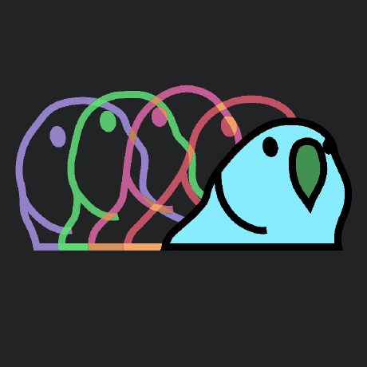
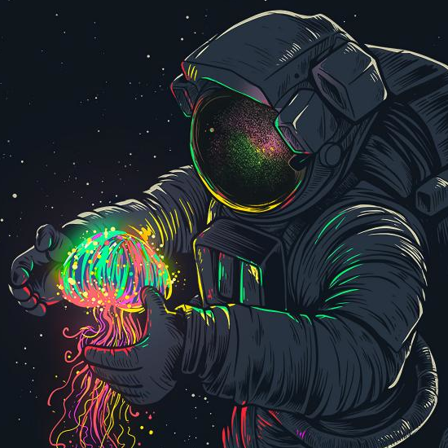
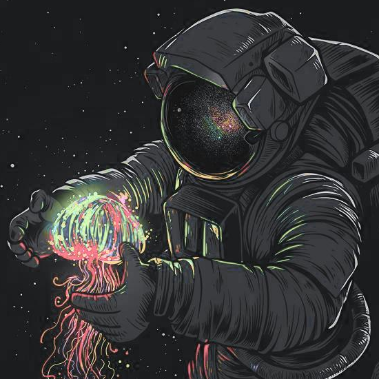
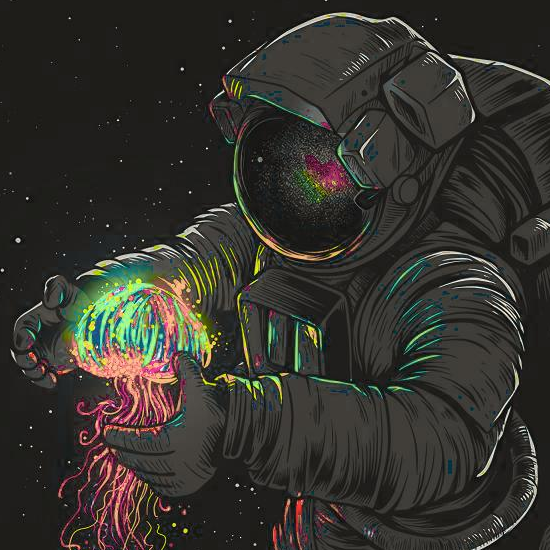
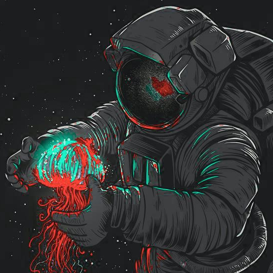

# ImageTheming

Change the color palette of an image to match your theme.

## Getting Started

Use `java -jar path/to/ImageTheming.jar -h` to get all available options that can/need to be set, to generate an image.
There must always be exactly one path and one theme for the program to work. An error message will appear if some 
options are set incorrect. Simple example:  
```shell
java -jar ImageTheming.jar https://avatars.githubusercontent.com/u/73987329\?v\=4 --theme=omni
```
This will select the image from the [link](https://avatars.githubusercontent.com/u/73987329\?v\=4) (a path instead of a 
link is also possible) and select the color scheme to be 
[Omni](https://raw.githubusercontent.com/Mayccoll/Gogh/master/themes/omni.sh). 

Original | New image with Omni theme
--- | ---
 | 

## Why

Ever wanted to use a wallpaper, but it didn't match your color theme?

## What to expect

This program will take an image and a theme from [Gogh](https://mayccoll.github.io/Gogh/) as minimal input. It then 
tries to match each pixel with a color from the given theme. The output is color-wise a downscaled version of the 
original image. Because of this, the best results can be achieved with images that have little to no blur, high 
resolution and clear defined lines. If you're going to watch all day at a generated image (wallpaper), you may want to 
edit the generated images afterwards in GIMP/similar software.  

To compare quality, here you have some examples. Keep in mind these are fairly zoomed in:

original | nord | solarized-dark | maia
--- | --- | --- | ---
 |  |  | 
